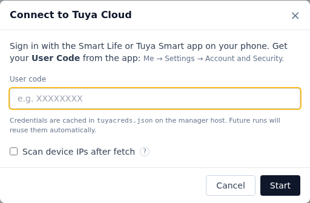

# Rustuya Manager

A management tool for [rustuya-bridge](https://github.com/3735943886/rustuya-bridge) that diffs Tuya Cloud devices against the running bridge and syncs add / remove / update operations. Includes a web UI with built-in Tuya Cloud login.


<sub>Desktop view — sync categories highlighted with their actions; the header's <b>☰ Menu</b> holds add device, cloud login, <b>📡 Scan</b>, theme, refresh, and <b>🔧 Reconfigure bridge</b>. Each row also carries a live-status dot and per-device ✎ edit / 🗑 remove / ↻ query-status icons.</sub>


<br><sub>Mobile view — layout adapts to narrow viewports.</sub>

<sub>Other views: [unannotated](docs/screenshots/main-light.png) · [dark](docs/screenshots/main-dark.png) · [bulk sync](docs/screenshots/sync-modal.png)</sub>

## Key Features

- **Status dashboard** — Missing / Orphaned / Mismatched / Synced categories by diffing the Tuya Cloud device list against the bridge's live state.
- **Built-in Tuya Cloud login** — fetch the device list straight from the web UI; no external tooling needed. A `tuyadevices.json` upload / drop-zone is still available for offline workflows.
- **No separate config** — picks up the bridge's topic and payload templates from its retained `bridge/config`.
- **Live updates over MQTT** — DPS values stream into the UI in real time.
- **Web UI** — single-page UI with search, sort, sub-device tree, per-device add / edit / remove and bulk-sync.

## Usage

Start with `--web` (the Docker image does this by default). The
dashboard loads every device known to either side and categorizes
it by how the bridge's view compares to the Tuya Cloud-of-record
— uploaded as `tuyadevices.json` or pulled in-app via the header **☰ Menu → ☁ Fetch from cloud**:

- 🟦 **Missing** — in cloud, not yet on the bridge. Click **Add** on
  the card to publish it; the bridge picks it up and starts polling.
- 🟥 **Orphan** — on the bridge, not in cloud (or dropped from cloud
  since last sync). Click **🗑** to remove it from the bridge.
- 🟨 **Mismatch** — in both, but a field drifted (IP / key / version
  differ). Click **Update** to push the cloud values; expand the row
  to see exactly which fields are out of sync.
- 🟩 **Synced** — in both, fields match. No action needed.

Every per-card action has a bulk path — the buttons above the list
(**Add missing** / **Remove orphan** / **Update mismatch** / **Apply
all**) open a modal showing the full plan, let individual rows be
unchecked to skip, then run them sequentially with per-row status.

Click any row to expand it: live DP values stream in via MQTT, plus
the bridge's last error/status message and the resolved IP / key /
version. The pencil ✎ opens an editor that re-publishes the device
to the bridge with the modified fields (the cloud-of-record JSON is
unchanged); the trash 🗑 removes the device from the bridge.

### Refreshing from Tuya Cloud

The header **☰ Menu → ☁ Fetch from cloud** opens the in-app login wizard. Sign in
once via QR with the Smart Life or Tuya Smart app — credentials are
cached in `tuyacreds.json`, so subsequent re-fetches skip the scan and
go straight to the device list.



**Scan device IPs after fetch** (off by default) decides what the
manager writes into the bridge record:

- **Off (default)** — devices ship to the bridge with no IP. The
  bridge runs its own LAN scan at runtime and catches DHCP IP
  changes automatically. Recommended unless every Tuya device on the
  LAN has a pinned address.
- **On** — best performance: the bridge **never scans the LAN** and
  every reconnect goes straight to the recorded address. Only useful
  when every device has a pinned IP (manual static or DHCP
  reservation on the router). On DHCP networks where leases rotate
  the bridge ends up retrying stale addresses; the header **☰ Menu →
  📡 Scan LAN** (or a fresh cloud re-fetch) recovers visibility.

The toggle state is persisted per browser.

**📡 Scan LAN** (header **☰ Menu**) asks the bridge for a one-shot LAN
scan. Any device registered with an explicit (non-auto) IP that has drifted
surfaces as `ERR_STATE 906` in the MSG line, so the right device can
be fixed at the router.

## Quick Start

Requires Python 3.10+ and a running [rustuya-bridge](https://github.com/3735943886/rustuya-bridge) reachable via MQTT.

### Install

**pipx (recommended)** — drops a `rustuya-manager` shim into `~/.local/bin/`, no activate step:
```bash
sudo apt install -y pipx                          # if not already
pipx ensurepath
pipx install rustuya-manager
```

**venv + pip** — alternative install without pipx:
```bash
python3 -m venv ~/.venvs/rustuya-manager
~/.venvs/rustuya-manager/bin/pip install rustuya-manager
~/.venvs/rustuya-manager/bin/rustuya-manager --help
```
Run it by full path, or activate the venv first (`source ~/.venvs/rustuya-manager/bin/activate`). The systemd unit in the next section assumes the pipx path — change `ExecStart` to `%h/.venvs/rustuya-manager/bin/rustuya-manager` for the venv install.

### Run

```bash
rustuya-manager --broker mqtt://localhost:1883 --root rustuya \
                --web --port 8373 --auth admin:CHANGE_ME
```
Then open the URL printed at startup. The default bind is `127.0.0.1` so the UI is reachable only from the same machine. To open it to the LAN add `--host 0.0.0.0` — pair with a real `--auth user:pass`.

Common flags:
- `--cloud PATH` (default `tuyadevices.json`) — Tuya devices JSON. If
  missing, the web UI offers an in-app Tuya Cloud login or a JSON
  drop-zone.
- `--broker URL` (default `mqtt://localhost:1883`) — accepts
  `mqtt://[user:pass@]host:port`.
- `--root TOPIC` (default `rustuya`) — must match the bridge's
  `--mqtt-root-topic`.
- `--host`, `--port` (default `127.0.0.1:8373`) — web server bind.
- `--auth USER:PASS` (default off) — HTTP Basic auth for the web UI.
- `--embed-bridge` (default off) — run the bridge inside this process
  via the `pyrustuyabridge` bindings (single-process deploy). Refused
  at startup if another bridge already publishes on `--root`.
- `--bridge-state PATH` (default: `rustuya.json` in the same
  directory as `--cloud`, matching the standalone bridge's filename) —
  embedded bridge's device state file. **Only meaningful with
  `--embed-bridge`.**
- `--bridge-config PATH` (default off) — JSON config file for the
  embedded bridge. Same format as `rustuya-bridge --config`: existing
  file is read and merged, missing file is auto-created from the
  merged settings. Allows setting custom topics / MQTT auth / scanner
  options without re-exposing every bridge flag here. **Only meaningful
  with `--embed-bridge`** — ignored otherwise.

  Special handling for the three fields that the manager and the bridge
  *both* care about (`mqtt_broker`, `mqtt_root_topic`, `state_file`):
  when `--bridge-config` supplies them, the manager adopts them as its
  own defaults too, so they only need to be specified once. Precedence:
    1. CLI flag (`--broker`, `--root`, `--bridge-state`)
    2. value from `--bridge-config`
    3. manager default (`mqtt://localhost:1883`, `rustuya`, `rustuya.json`
       next to `--cloud`)

  If a CLI flag and the bridge-config value disagree, the CLI value
  overrides (the embedded bridge ends up with the same kwarg) and a
  warning is logged so the contradiction doesn't go unnoticed.

### Run as a service (systemd, user-level, no sudo)

```bash
mkdir -p ~/.config/systemd/user ~/.local/share/rustuya-manager
cp examples/rustuya-manager.service ~/.config/systemd/user/
# edit the file — change --auth, --broker, --root to match the local setup
systemctl --user daemon-reload
systemctl --user enable --now rustuya-manager
journalctl --user -u rustuya-manager -f         # follow logs
```

To keep the service running after logout (one-time, the only sudo step):
```bash
sudo loginctl enable-linger $USER
```

### Update

```bash
pipx upgrade rustuya-manager                                   # pipx install
# or, for the venv install:
~/.venvs/rustuya-manager/bin/pip install -U rustuya-manager
systemctl --user restart rustuya-manager
```

## Docker

Single-container deploy with the bridge bundled in. Aimed at HA OS,
unraid, CasaOS, and similar container-first setups — distinct from the
pipx + systemd track above, which keeps `rustuya-bridge` as a separate
service.

```bash
docker run -d \
  --name rustuya-manager \
  --network host \
  --restart unless-stopped \
  -e AUTH=admin:CHANGE_ME \
  -v rustuya-manager-data:/data \
  3735943886/rustuya-manager:latest
```

The broker defaults to `mqtt://localhost:1883` (which `--network host`
makes a host-local mosquitto). For a remote broker, set `mqtt_broker`
in `/data/config.json` (the embedded bridge auto-creates this on first
boot) — that's the single source of truth the bridge already reads. The
`BROKER` env var is still available as a quick override but is not
shown here on purpose: the env-vs-config-file precedence story (see the
table below) is easier to keep straight when one place owns the value.

`--restart unless-stopped` is intentional: with `--embed-bridge` on (the
image default), the manager process is the de-facto supervisor for the
in-process bridge thread, and the manager has no in-process watchdog if
that thread dies (see [docs/internals.md §1.2](docs/internals.md)).
Restarting the manager container respawns a fresh embedded bridge with
it, so docker's restart policy covers both. Drop the flag only if you
deliberately want a one-shot, non-resilient run.

The image runs `rustuya-manager --web --embed-bridge` — manager and
bridge live in the same process, so the only external dependency is an
MQTT broker. If you're already running rustuya-bridge separately
(systemd service or a sibling container) and pointing both at the
same broker, pass `-e EMBED_BRIDGE=0` so the container doesn't spawn
a second bridge that would double-publish on the same MQTT topics.

`--network host` is **required**: the embedded `rustuya-bridge` scans
the LAN with UDP broadcasts on ports 6666/6667 to discover Tuya
devices, and Docker's default bridge network isolates broadcast
traffic to the docker bridge — devices are never seen. Host networking
gives the container direct access to the LAN segment.

Environment variables (defaults shown; all optional unless noted):

| Variable | Default | Maps to |
|---|---|---|
| `HOST` | `0.0.0.0` | `--host` |
| `PORT` | `8373` | `--port` |
| `BROKER` | *(unset — manager falls back to bridge-config, then `mqtt://localhost:1883`)* | `--broker` |
| `ROOT` | *(unset — manager falls back to bridge-config, then `rustuya`)* | `--root` |
| `AUTH` | *(off)* | `--auth USER:PASS` |
| `CLOUD` | `/data/tuyadevices.json` | `--cloud` |
| `PLUGIN_DIR` | `/data/plugins` | `--plugin-dir` |
| `BRIDGE_CONFIG` | `/data/config.json` | `--bridge-config` |
| `BRIDGE_STATE` | *(unset — manager falls back to bridge-config `state_file`, then `/data/rustuya.json`)* | `--bridge-state` |
| `PUID` | `1000` | UID the app runs as |
| `PGID` | `1000` | GID the app runs as |
| `EMBED_BRIDGE` | `1` | `--embed-bridge` (set `0` to skip when an external bridge is already on the broker) |

`BROKER` / `ROOT` / `BRIDGE_STATE` are deliberately left **unset** in the
image — the entrypoint only adds the corresponding `--broker` / `--root`
/ `--bridge-state` flag when the env var is set. Leaving them unset
means edits to `/data/config.json` (`mqtt_broker`, `mqtt_root_topic`,
`state_file`) win on their own, with no second source of truth in the
container env to silently override them. Setting the env var still
overrides bridge-config (with a startup warning if they disagree) for
the case where the env IS the canonical place.

Every persistent artifact — cloud cache (`tuyadevices.json`), wizard
credentials (`tuyacreds.json`), embedded bridge config (`config.json`,
auto-created on first run from defaults), and bridge state
(`rustuya.json`) — lives under `/data` so the volume is the sole
backup target. To disable any of the optional flags pass an empty
value, e.g. `-e BRIDGE_CONFIG=` to skip writing a bridge config file.

For **bind-mounted** host directories (`-v /host/path:/data` instead
of the named-volume `rustuya-manager-data:/data`), pass `PUID`/`PGID`
so the in-container user can write to them:

```bash
-e PUID=$(id -u) -e PGID=$(id -g)
```

The entrypoint then renumbers its internal `manager` user to that
UID/GID and `chown`s `/data` on startup, so any host owner works. With
named volumes Docker handles ownership and the defaults are fine.

### Drop-in plugins

Plugins normally ship as pip-installed packages (the
`rustuya_manager.plugins` entry-point group). For Docker — where you'd
otherwise rebuild the image — you can instead **drop a plugin into a
directory** and have it loaded at startup. The image defaults
`PLUGIN_DIR=/data/plugins`; mount a folder there and drop in either a
package (a directory with `__init__.py` exposing `register(ctx)`) or a
single `*.py` file:

```
/data/plugins/
  rustuya_hello/        # package plugin
    __init__.py         #   defines register(ctx)
    static/             #   its UI assets (served automatically)
  quicktweak.py         # single-file plugin: just register(ctx)
```

Restart the container to pick up changes (plugins load once at boot).
Outside Docker, point the manager at any directory with
`--plugin-dir DIR` (or `RUSTUYA_MANAGER_PLUGIN_DIR`); it's opt-in, so
nothing is scanned unless set. Two caveats: a drop-in plugin **can't
install its own dependencies** (it gets the standard library plus what
the manager already provides — for anything heavier, install it as an
entry-point package instead), and loading code from this directory
**executes it in-process**, so only point it at plugins you trust. See
[`examples/hello_plugin`](examples/hello_plugin) for a complete plugin.

## License
MIT
