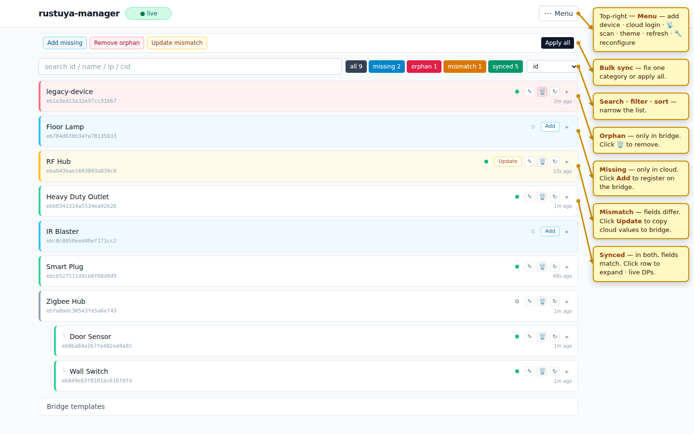
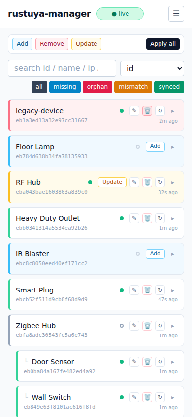

# Rustuya Manager

A management tool for [rustuya-bridge](https://github.com/3735943886/rustuya-bridge) that diffs Tuya Cloud devices against the running bridge and syncs add / remove / update operations. Ships with a web UI with built-in Tuya Cloud login.


<sub>Desktop view — sync categories highlighted with their primary actions.</sub>


<br><sub>Mobile view — hamburger menu, search + sort paired on one row, filters wrap below.</sub>

<sub>Other views: [unannotated](docs/screenshots/main-light.png) · [dark](docs/screenshots/main-dark.png) · [bulk sync](docs/screenshots/sync-modal.png)</sub>

## Key Features

- **Status dashboard** — Missing / Orphaned / Mismatched / Synced categories by diffing the Tuya Cloud device list against the bridge's live state.
- **Built-in Tuya Cloud login** — fetch the device list straight from the web UI; no external tooling needed. A `tuyadevices.json` upload / drop-zone is still available for offline workflows.
- **No separate config** — picks up the bridge's topic and payload templates from its retained `bridge/config`.
- **Live updates over MQTT** — DPS values stream into the UI in real time.
- **Web UI** — single-page UI with search, sort, sub-device tree, per-device add / edit / remove and bulk-sync.

## Quick Start

Requires Python 3.10+ and a running [rustuya-bridge](https://github.com/3735943886/rustuya-bridge) reachable via MQTT.

### Install

**pipx (recommended)** — drops a `rustuya-manager` shim into `~/.local/bin/`, no activate step:
```bash
sudo apt install -y pipx                          # if not already
pipx ensurepath
pipx install rustuya-manager
```

**venv + pip** — alternative install without pipx:
```bash
python3 -m venv ~/.venvs/rustuya-manager
~/.venvs/rustuya-manager/bin/pip install rustuya-manager
~/.venvs/rustuya-manager/bin/rustuya-manager --help
```
Run it by full path, or activate the venv first (`source ~/.venvs/rustuya-manager/bin/activate`). The systemd unit in the next section assumes the pipx path — change `ExecStart` to `%h/.venvs/rustuya-manager/bin/rustuya-manager` for the venv install.

### Run

```bash
rustuya-manager --broker mqtt://localhost:1883 --root rustuya \
                --web --port 8373 --auth admin:CHANGE_ME
```
Then open the URL printed at startup. The default bind is `127.0.0.1` so the UI is reachable only from the same machine. To open it to the LAN add `--host 0.0.0.0` — pair with a real `--auth user:pass`.

Common flags:
- `--cloud PATH` (default `tuyadevices.json`) — Tuya devices JSON. If
  missing, the web UI offers an in-app Tuya Cloud login or a JSON
  drop-zone.
- `--broker URL` (default `mqtt://localhost:1883`) — accepts
  `mqtt://[user:pass@]host:port`.
- `--root TOPIC` (default `rustuya`) — must match the bridge's
  `--mqtt-root-topic`.
- `--host`, `--port` (default `127.0.0.1:8373`) — web server bind.
- `--auth USER:PASS` (default off) — HTTP Basic auth for the web UI.
- `--embed-bridge` (default off) — run the bridge inside this process
  via the `pyrustuyabridge` bindings (single-process deploy). Refused
  at startup if another bridge already publishes on `--root`.
- `--bridge-state PATH` (default: `bridge-state.json` next to
  `--cloud`) — embedded bridge's device state file. **Only meaningful
  with `--embed-bridge`.**
- `--bridge-config PATH` (default off) — JSON config file for the
  embedded bridge. Same format as `rustuya-bridge --config`: existing
  file is read and merged, missing file is auto-created from the
  merged settings. Allows setting custom topics / MQTT auth / scanner
  options without re-exposing every bridge flag here. **Only meaningful
  with `--embed-bridge`** — ignored otherwise.

  Special handling for the two fields that the manager and the bridge
  *both* care about (`mqtt_broker`, `mqtt_root_topic`): when
  `--bridge-config` supplies them, the manager adopts them as its own
  defaults too, so they only need to be specified once. Precedence:
    1. CLI flag (`--broker`, `--root`)
    2. value from `--bridge-config`
    3. manager default (`mqtt://localhost:1883`, `rustuya`)

  If a CLI flag and the bridge-config value disagree, the CLI value
  overrides (the embedded bridge ends up with the same kwarg) and a
  warning is logged so the contradiction doesn't go unnoticed.

### Run as a service (systemd, user-level, no sudo)

```bash
mkdir -p ~/.config/systemd/user ~/.local/share/rustuya-manager
cp examples/rustuya-manager.service ~/.config/systemd/user/
# edit the file — change --auth, --broker, --root to match the local setup
systemctl --user daemon-reload
systemctl --user enable --now rustuya-manager
journalctl --user -u rustuya-manager -f         # follow logs
```

To keep the service running after logout (one-time, the only sudo step):
```bash
sudo loginctl enable-linger $USER
```

### Update

```bash
pipx upgrade rustuya-manager                                   # pipx install
# or, for the venv install:
~/.venvs/rustuya-manager/bin/pip install -U rustuya-manager
systemctl --user restart rustuya-manager
```

## Docker

Single-container deploy with the bridge bundled in. Aimed at HA OS,
unraid, CasaOS, and similar container-first setups — distinct from the
pipx + systemd track above, which keeps `rustuya-bridge` as a separate
service.

```bash
docker run -d \
  --name rustuya-manager \
  --network host \
  -e BROKER=mqtt://your-mosquitto-host:1883 \
  -e AUTH=admin:CHANGE_ME \
  -v rustuya-manager-data:/data \
  3735943886/rustuya-manager:latest
```

The image runs `rustuya-manager --web --embed-bridge` — manager and
bridge live in the same process, so the only external dependency is an
MQTT broker.

`--network host` is **required**: the embedded `rustuya-bridge` scans
the LAN with UDP broadcasts on ports 6666/6667 to discover Tuya
devices, and Docker's default bridge network isolates broadcast
traffic to the docker bridge — devices are never seen. Host networking
gives the container direct access to the LAN segment. (With host
networking the `-p` flag is unnecessary; the container binds `PORT`
directly on the host.)

Environment variables (defaults shown; all optional unless noted):

| Variable | Default | Maps to |
|---|---|---|
| `HOST` | `0.0.0.0` | `--host` |
| `PORT` | `8373` | `--port` |
| `BROKER` | `mqtt://localhost:1883` | `--broker` |
| `ROOT` | `rustuya` | `--root` |
| `AUTH` | *(off)* | `--auth USER:PASS` |
| `CLOUD` | `/data/tuyadevices.json` | `--cloud` |
| `BRIDGE_CONFIG` | `/data/config.json` | `--bridge-config` |
| `BRIDGE_STATE` | `/data/rustuya.json` | `--bridge-state` |

Every persistent artifact — cloud cache (`tuyadevices.json`), wizard
credentials (`tuyacreds.json`), embedded bridge config (`config.json`,
auto-created on first run from defaults), and bridge state
(`rustuya.json`) — lives under `/data` so the volume is the sole
backup target. To disable any of the optional flags pass an empty
value, e.g. `-e BRIDGE_CONFIG=` to skip writing a bridge config file.

## License
MIT
